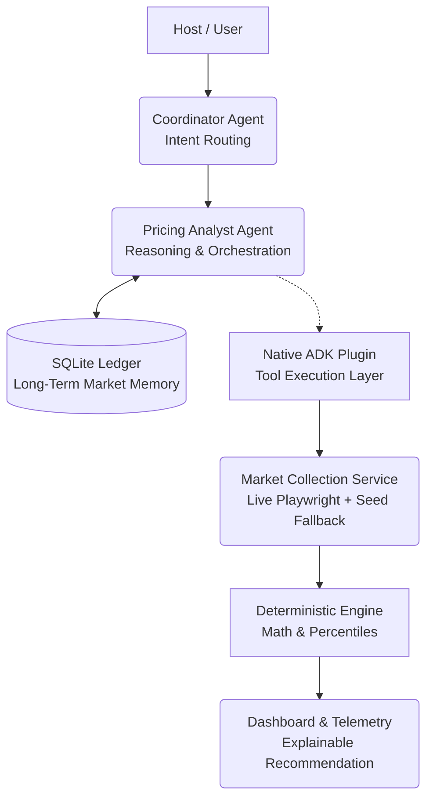
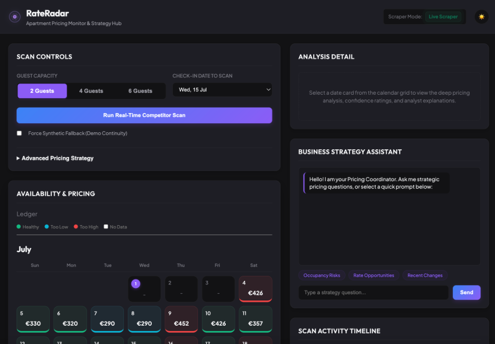
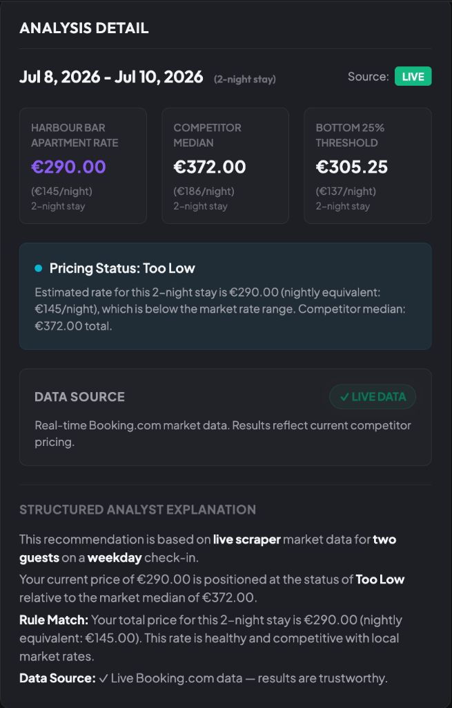
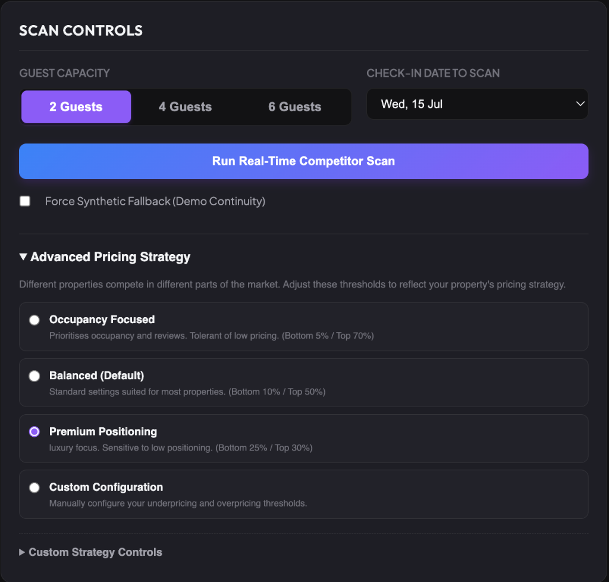
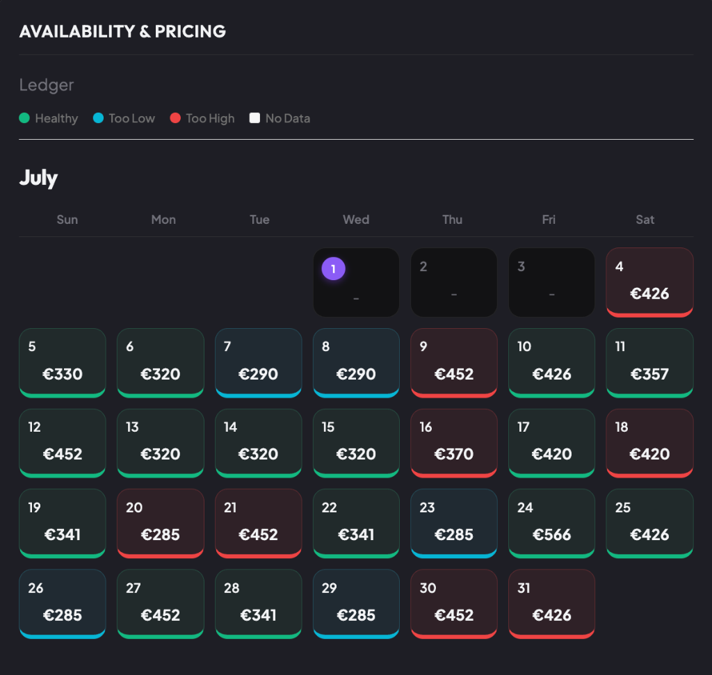
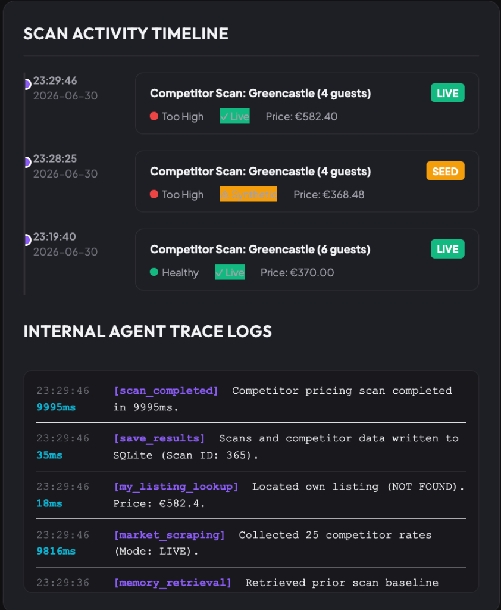

# RateRadar: Autonomous Pricing Intelligence for Short-Term Rentals

**RateRadar** is an autonomous multi-agent pricing intelligence platform for self-catering properties, developed as a Kaggle/Google AI Agents capstone project. In this instance, we monitored a self-catering apartment in Donegal, Ireland.

Short-term rental pricing is traditionally reactive, manual, and fragmented. Managing a 90-day window across multiple guest counts requires **270 manual checks every week**. This leads to two costly failures: **Lost Revenue** during demand spikes, and **Empty Calendars** as booking windows close.

**RateRadar** solves this by automating market scanning and goes beyond basic scrapers by allowing hosts to configure pricing thresholds to match their specific business strategy. In our live capstone rollout, the system executed **263 live market scrapes** autonomously against real-world travel websites protected by anti-bot mechanisms, and maintained dashboard availability throughout testing by gracefully degrading to synthetic seed data whenever live scraping failed. It achieved a **4.89/5.0** LLM evaluation score for its dynamic strategy reasoning.

### 🎥 Capstone Video Presentation
[](https://youtu.be/erABGKKtvMw)
---

## Architecture Overview



---

## Dashboard Interface


*The main hub: Strategy configuration, active scans, conversational business assistant, and long-term calendar ledger.*


*Deterministic math grounding provides explainable AI recommendations verified against live market percentiles.*


*Host-configurable strategies adapt the agent's threshold tolerance for occupancy vs premium positioning.*


*Long-term memory ledger stores past interactions to dynamically recalculate calendar alerts without redundant scraping.*


*Agentic observability timeline exposes tool execution speeds, fallback activations, and memory retrievals.*

---

## 1. Core Capabilities & Value Proposition

*   **Configurable Market Strategy**: Supports three strategy presets plus custom configurations to match property positioning:
    *   `Occupancy Focused`: Tolerant of lower prices to maximize booking rate and review volume (Bottom 5% / Top 70% alert boundaries).
    *   `Balanced (Default)`: Standard settings suited for most average properties (Bottom 10% / Top 50% alert boundaries).
    *   `Premium Positioning`: Luxury focus protecting brand value (Bottom 25% / Top 30% alert boundaries).
    *   `Custom configuration`: Allow manual adjustments to underpricing and overpricing sliders.
*   **Dynamic Calendar Recalculation**: Changing strategy configurations on the dashboard immediately updates the entire calendar's colors, active alerts, and advice text in real time. The backend re-evaluates database-stored competitor rates on-the-fly, eliminating redundant scraper executions.
*   **Deterministic Math Grounding**: Percentile thresholds and status classifications (`Too Low`, `Too High`, `Healthy`) are computed programmatically in Python before being passed to the Pricing Analyst Agent. This guarantees mathematical accuracy and prevents agent hallucinations.
*   **Rate-Limited Scraper Management**: The background scheduler chunks the 3-month scanning window into weekly batches, introducing randomized request delays between scans and a 60-second cool-down period between batches. It incorporates an early-stop block guardrail (consecutive failures override scanning with a safe synthetic fallback) to defend against IP bans.
*   **Resilient Data Hybrid Layer (Demo Continuity)**: Uses a best-effort Playwright scraper backed by a fallback synthetic data generator, ensuring the dashboard remains 100% functional during presentations and evaluations even when travel search pages block IP requests.
*   **Long-Term Memory Ledger**: Retrieves historical market summaries from the SQLite memory ledger, enabling the Pricing Analyst Agent to compare current market conditions with previous scans and explain changes over time.

---

## 2. Dynamic Pricing Strategy Logic

RateRadar uses a validated, threshold-aware pricing classifier on the backend. **The Pricing Analyst Agent never performs these calculations itself. All mathematical thresholds are computed deterministically by the backend before being supplied to the agent as structured context.**

```python
# Underpricing Alert Threshold (Bottom X%)
lower_cutoff = percentile(competitor_prices, too_low_pct)

# Overpricing Alert Threshold (Top Y%)
# "Top Y%" means prices higher than (100-Y)% of the market, so we calculate the (100-Y)th percentile.
upper_cutoff = percentile(competitor_prices, 100 - too_high_pct)
```

### Safety Guardrails & Validation
*   **Overlap Protection**: Enforces the business rule that pricing bands cannot overlap. If `too_low_pct >= (100 - too_high_pct)` is requested, the API rejects it with an `HTTP 400` response:
    ```json
    {"error": "Invalid thresholds: too_low_pct must be less than (100 - too_high_pct) to avoid overlapping pricing bands."}
    ```
*   **Input Constraints**: Restricts checking dates to tomorrow's date up to a 90-day time horizon and verifies guest counts (must be 2, 4, or 6).

---

## 3. Project Structure

**The project is organized around a strict separation of concerns between orchestration, reasoning, data collection, persistence, and deployment.**

```
pricing-monitor/
├── app/
│   ├── agent.py                      # Multi-agent coordination and pricing reasoning LLM definitions
│   ├── main.py                       # FastAPI REST API endpoints, static assets, and chat session handler
│   ├── database.py                   # SQLite persistence, dynamic status recalculations, and CSV exports
│   ├── seed_db.py                    # Seeding script populating initial pricing records
│   └── app_utils/                    # Helper packages for telemetry logging and validation types
├── skills/
│   ├── booking-market-collection.md  # Data collection operational skill definition
│   ├── pricing-analysis.md           # Pricing math and strategy rules skill definition
│   ├── dashboard-narrative.md        # API and CSV integration skill definition
│   └── capstone-demo.md              # Presenter walkthrough guide and demo script
├── data/
│   └── pricing_history.csv           # Synchronized flat-file ledger for BI tool integration
├── deployment/
│   └── terraform/                    # Terraform configurations for Cloud Run deployment
├── tests/
│   └── eval/                         # Dataset and scenarios for LLM-as-judge evaluation
├── scraper.py                        # Programmatic Playwright/BeautifulSoup Booking.com scraper
├── scheduler.py                      # Weekly scan runner (APScheduler) for the 3-month window
├── pyproject.toml                    # Pyproject configuration listing all dependencies
├── Dockerfile                        # Docker configuration packaging the web app for Cloud Run
└── mcp_server.py                     # Custom MCP server exposing collection tools to ADK agents
```

---

## 4. Course Concepts Demonstrated

| Concept | Where demonstrated | File |
|---|---|---|
| **Multi-Agent Orchestration** | Coordinator Agent, Pricing Analyst Agent, Alert Notification Agent hierarchy | `app/agent.py` |
| **Custom MCP Server** | Exposing `fetch_competitor_prices` and `fetch_my_listing_prices` tools to ADK | `mcp_server.py` |
| **Security Guardrails** | API key verification, input validation limits, parameterized SQL statements, overlap validation, scraper rate limiting | `app/main.py`, `scheduler.py` |
| **Agentic Observability** | Execution step logger, millisecond trace timers, SQL logger, dashboard step tracer | `app/database.py` |
| **Agent Skills / CLI** | Structured SKILL.md specs, validation with `agents-cli lint` and quality grading | `skills/` |
| **Deployability** | Terraform modules, Cloud Run resources, and weekly-chunked batch scheduler | `Dockerfile`, `scheduler.py` |
| **Stateful Agents (Memory)** | SQLite persistence ledger storing historical recommendations | `app/database.py` |
| **ADK Evaluation** | LLM-as-judge scoring on a Golden Dataset (4.89/5.0) | `tests/eval/` |
| **Graceful Degradation** | Synthetic seed fallback when Playwright fails on Cloud Run | `scraper.py` |

---

## 5. Verification & Testing

**RateRadar is verified using two complementary approaches: deterministic pytest checks for the mathematical engine, and an ADK evaluation harness for agent reasoning.** 100% of integration tests and agent evaluation datasets pass successfully.

### Running the verification suite
To execute all unit, integration, and agent quality evaluation checks:
```bash
uv run pytest && agents-cli eval run
```

### Running unit & integration tests
```bash
uv run pytest
```

### Running LLM-as-judge quality evaluations
```bash
agents-cli eval run
```
The agent evaluation evaluates natural-language pricing recommendations against a test dataset, returning a mean response quality score of **4.8889/5.0**.

The weekly-chunked scheduler completed the full three-month scan successfully, with 263 live scrapes, 1 automatic fallback, and 0 failures.

---

## 6. How to Run the Application Locally

### Prerequisites
*   **uv**: Python package manager.
*   **Playwright Browsers**:
    ```bash
    uv run playwright install
    ```

### Seeding the Database
Populate the ledger with initial scan records:
```bash
uv run python app/seed_db.py
```

### Starting the Server
Start the local FastAPI server:
```bash
uv run python app/main.py
```
Open **[http://localhost:8080/dashboard](http://localhost:8080/dashboard)** in your browser.

*   **Demo Fallback Mode**: Check the **Force Synthetic Fallback** box on the UI. Scans will complete in under 2 seconds.
*   **Live Scraper Mode**: Uncheck the box. Playwright will launch, scrape Booking.com rates live, and display the green `✓ LIVE DATA` badge.

---

## 7. Cloud Deployment (Cloud Run)

### Manual Container Build & Deploy
1. Build and push the image to Google Artifact Registry:
   ```bash
   gcloud builds submit --tag europe-west1-docker.pkg.dev/your-project-id/your-repo/pricing-monitor:latest .
   ```
2. Deploy the container:
   ```bash
   gcloud run deploy pricing-monitor \
     --image europe-west1-docker.pkg.dev/your-project-id/your-repo/pricing-monitor:latest \
     --platform managed \
     --region europe-west1 \
     --allow-unauthenticated \
     --memory 2Gi \
     --cpu 2 \
     --set-env-vars PRICING_MONITOR_API_KEY=your-secret-api-key-here
   ```

> **Security note:** `--allow-unauthenticated` allows public access at the Cloud Run network level. Application-level access control is enforced separately via the `X-API-Key` header requirement on all API endpoints in `app/main.py`.
> 
> **Architecture Note (Graceful Fallback):** The Cloud Run deployment uses synthetic seed data to guarantee a stable, fully-populated dashboard experience for evaluators. The live Playwright scraper was verified to work successfully in local testing, completing 263 real Booking.com scans across a 3-month window without IP blocking, using randomised request delays and batch cooldowns. Deploying Playwright-based scraping reliably in a containerised cloud environment requires residential proxy infrastructure to avoid OTA bot protection — a production enhancement beyond the scope of this capstone. The synthetic fallback is clearly labelled throughout the dashboard and all confidence scores reflect the data source accurately.

### Infrastructure as Code (Terraform)
Provision GCP Cloud Run instances automatically:
```bash
cd deployment/terraform/single-project
terraform init
terraform apply
```

---

## Capstone Submission

**Kaggle writeup:** [Link to be added]  
**Demo video:** [https://youtu.be/erABGKKtvMw](https://youtu.be/erABGKKtvMw)  
**Live demo:** [https://rateradar-606493503364.us-central1.run.app/dashboard](https://rateradar-606493503364.us-central1.run.app/dashboard)  
**GitHub repository:** [https://github.com/eoghankealy/rateradar](https://github.com/eoghankealy/rateradar)
